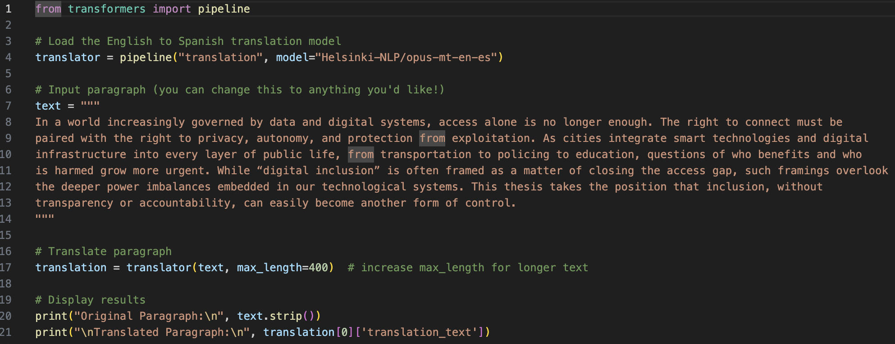
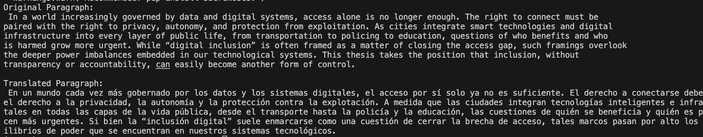

# Assignment 8
I chose to use an LLM for translation, called Helsinki-NLP/opus-mt-en-es. It translates English writing to Spanish. I chose this model because I am creating a resource for my thesis that will need to be translated into Spanish, and this could be a great way to translate big chunks of writing. 

Here is the [code](main.py):

An example of the output:

